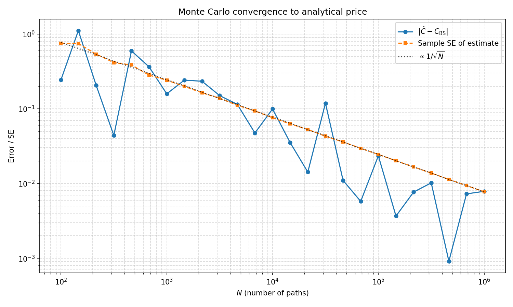

# Цена колл опциона Европейского типа

Требуется оценить цену колл опциона Европейского типа методом **Монте‑Карло** и показать корректность реализации.

Параметры из задания:

| Параметр | Значение |
|----------|----------|
| Безрисковая ставка $r$ | $0.05$ |
| Волатильность $\sigma$ | $0.1$ |пше
| Спот $S_0$ | $100$ |
| Страйк $K$ | $100$ |
| Срок $T$ | $1$ |
| Число траекторий $N$ | $1\,000\,000$ |

## Теория

Теоретическая цена:

```math
C_T = e^{-rT}\,\mathbb{E}\bigl[(S_T - K)^+\bigr],\qquad x^+ = \max(0,x).
```

Оценка Монте‑Карло:

```math
\hat{C}_T = e^{-rT}\,\frac{1}{N}\sum_{j=1}^{N}\bigl(\tilde{S}_{j,T} - K\bigr)^+.
```

Дискретное приращение записывается с дрейфом $r$:

```math
\tilde{S}_{t_i} = \tilde{S}_{t_{i-1}}\bigl(1 + r\,\delta + \sigma\sqrt{\delta}\,X_i\bigr),\quad X_i\sim N(0,1).
```

В реализации основной эксперимент использует точную выборку $S_T$ при логнормальном законе:

```math
S_T = S_0\exp\Bigl(\bigl(r - \tfrac{\sigma^2}{2}\bigr)T + \sigma\sqrt{T}\,Z\Bigr),\quad Z\sim N(0,1).
```

Для **проверки корректности** вычисляется аналитическая цена **Блэка–Шоулза**:

```math
C_T = S_0\,\Phi(y_+) - K e^{-rT}\,\Phi(y_-),
```

```math
y_\pm = \frac{\ln(\frac{S_0}{K}) + T\,(r \pm \sigma^2/2)}{\sigma\sqrt{T}},
```

где $\Phi$ - функция распределения стандартного нормального закона.

Погрешность метода Монте‑Карло по статистике убывает как $\frac{1}{\sqrt{N}}$, при $N=10^6$ типичный масштаб ошибки оценки - порядка $10^{-3}$.

## Решение

Реализация представлена в скрипте [call_option.py](call_option.py) с использованием библиотек `numpy` и `matplotlib` для визуализации. В качестве генератора использован `numpy.random.Generator` (PCG64).

Дополнительно выводится иллюстрация **явной схемы Эйлера** с малым числом шагов и траекторий. У такой схемы есть смещение порядка $O(\delta)$ относительно непрерывной модели.

## Эксперимент

При сравнении с аналитикой при $N=10^6$ оценка $\hat{C}_T$ и аналитический $C_{\mathrm{BS}}$ должны отличаться примерно на величину стандартной ошибки оценки. Для демонстрации сходимости по $N$ значений строится график $|\hat{C}_T - C_{\mathrm{BS}}|$ и выборочной стандартной ошибки, ожидается согласование с масштабом $\frac{1}{\sqrt{N}}$.

График сохраняется в `convergence.png` после запуска.

## Запуск

```shell
python3 -m venv --prompt callopt .venv
source .venv/bin/activate
pip install -r requirements.txt
python3 call_option.py
```

## Результаты

Вывод

```shell
Parameters:
r=0.05, sigma=0.1, S0=100.0, K=100.0, T=1.0, N=1000000
Analytical price (Black-Scholes): 6.804958

Monte Carlo (exact S_T sampling)
Estimate: 6.812905
Standard error (s/sqrt(N), discounted): 0.007734
Deviation from analytical: +0.007947
Elapsed: 0.028 s

Monte Carlo (N=1000000, n_steps=100)
Estimate: 6.792806 (scheme bias O(delta); large n_steps and N approach BS)
Standard error: 0.007727
Deviation from analytical: -0.012152
Elapsed: 0.996 s
```

Отклонение Монте‑Карло с $N=10^6$ от аналитики по модулю сопоставимо с заявленной стандартной ошибкой (~$10^{-3}$), то есть функциональная корректность подтверждается.

График сходимости (логарифмический масштаб по $N$):


