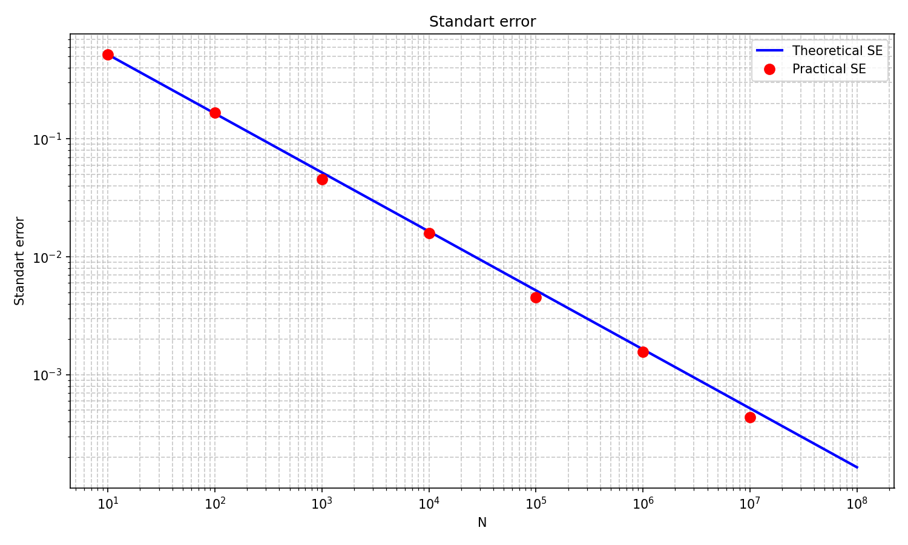
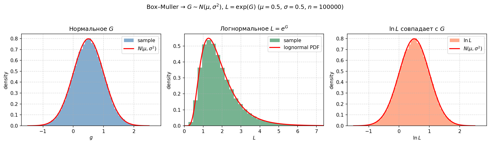

# Монте-Карло вычисление числа π

Требуется реализовать бенчмарк для оценки числа $\pi$ методом Монте‑Карло.  

Используется $N = 100\,000\,000$ случайных точек, равномерно распределённых в единичном квадрате $[0,1)\times[0,1)$.  
Доля точек, попавших в четверть круга радиуса 1, позволяет оценить $\pi$:

```math
\hat{\pi} = 4 \cdot \frac{\text{число точек под кривой}}{N}
```

## Эксперимент

- Генерируем пары $(x_i, y_i)$, $i = 1,\dots,N$, где $x_i, y_i \sim U(0,1)$.
- Вычисляем индикатор попадания в четверть круга:
```math
I_i = \begin{cases}
1, & x_i^2 + y_i^2 \le 1,\\
0, & \text{иначе}
\end{cases}
```
- Оценка числа $\pi$:
```math
\hat{\pi} = \frac{4}{N} \sum_{i=1}^{N} I_i
```

В силу ЗБЧ $\hat{\pi} \to \pi$ при $N\to\infty$, а стандартная ошибка оценки убывает как $1/\sqrt{N}$.

## Генератор

В реализации используется библиотечная функция `numpy.random` или `random`, основанная на генераторе случайных чисел **MT19937**. С помощью `numpy` производится векторизация вычислений.

## Оценка точности

При $N = 10^8$ среднеквадратичная ошибка метода Монте‑Карло составляет:

```math
\sigma_{\hat{\pi}} = \sqrt{\frac{\pi(4-\pi)}{N}} \approx 6.7\cdot 10^{-5}
```
## Запуск

```shell
python3 -m venv --prompt mcpi .venv
source .venv/bin/activate
pip install -r requirements.txt
python3 monte_carlo.py
```

## Результаты

```text
Theoretical π = 3.141593
Practical π = 3.141489
Elapsed time: 1.44s
```

Полученная оценка $3.141489$ отклоняется от истинного $\pi$ на $2.34\cdot 10^{-4}$, что находится в пределах ожидаемой погрешности порядка $10^{-4}$.

График стандартной ошибки в зависимости от N в логарифмическом масштабе:



## Нормальное и логнормальное распределения

Из равномерных $U_1, U_2 \sim U(0,1)$ метод **Бокса–Мюллера** даёт пару независимых стандартных нормальных величин:

```math
Z_1 = \sqrt{-2\ln U_1}\cos(2\pi U_2), \quad
Z_2 = \sqrt{-2\ln U_1}\sin(2\pi U_2).
```

Линейное преобразование $G = \mu + \sigma Z$ задаёт $G \sim N(\mu, \sigma^2)$. Логнормальная величина опирается на то же подлежащее нормальное распределение (к$l = \exp(g)$ при $g \sim N(a,\sigma)$):

```math
L = e^G.
```

Тогда $\ln L = G$, то есть $\ln L \sim N(\mu, \sigma^2)$. В скрипте `monte_carlo.py` после оценки $\pi$ и графика стандартной ошибки строится трёхпанельный рисунок: гистограмма $G$ и плотность $N(\mu,\sigma^2)$; гистограмма $L$ и плотность логнормального закона; гистограмма $\ln L$ и снова $N(\mu,\sigma^2)$ - наглядная зависимость нормального и логнормального распределений при имитационном (Монте‑Карло) моделировании.

