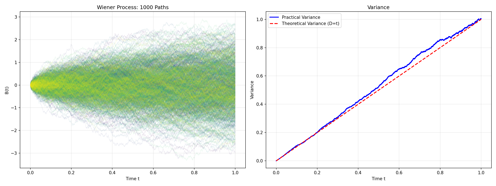

# Винеровский процесс

Требуется сгенерировать графики 1000 траекторий Винеровского процесса с $T = 1$, $\delta = 0.0001$.

## Решение

Для построение Винеровского процесса используется соотношение:
```math
B_{t+u} - B_t \sim N(0, u)
```

Для шага $\delta$:
```math
B_{t_i + 1} = B_{t_i} + \sqrt{\delta} \cdot \xi_i,
```
где
- $B_{t_0} = 0$
- $\delta = 0.0001$ - шаг дискретизации
- $\xi_i$ - независимые случайные величины, распределенные по нормальному закону $\xi_i \sim N(0, 1)$, т.е. $E\xi_i = 0$, $D\xi_i = 1$

Накопительная сумма:
```math
B_{t_k} = \sum_{i=1}^k \sqrt{\delta} \cdot \xi_i
```

$B_0 = 0$ ($P$-п.н.)


## Оценка дисперсии

По определению $B_t \sim N(0, t)$, т.е. теоритическая дисперсия Винеровского процесса $D[B_t] = t$ и в момент $T=1$ равна $D[B_t](T) = 1$

Дисперсия будет считаться по формуле:
```math
D[B_t] = \frac{1}{N-1} \sum_{i=1}^N (B_t^{i} - \bar{B_t})^2
```

## Запуск

```shell
python3 -m venv --prompt wiener .venv
source .venv/bin/activate
pip install -r requirements.txt
python3 wiener.py
```

Практические оценки на 1000 траекторий:

```shell
Mean: -0.0064
Variance: 0.8825
```
Получающийся график симуляции Винеровского процесса вместе с оценкой дисперсии:

